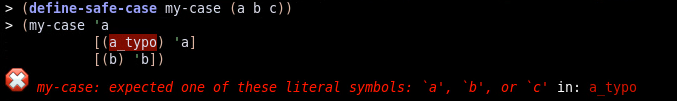

safe-case
=========

`safe-case` is for those who like `case` but fear uncaught typos.

Some typos can be caught as early as compile time:

Others are caught at runtime.

See the [docs](https://docs.racket-lang.org/safe-case/index.html).
